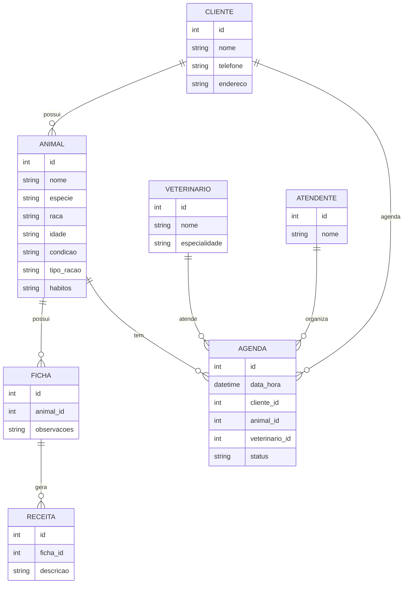

# isabelle_hister
Aula de engenharia de software

---
# 1. Descrição do sistema

Sistema para clínica veterinária.

Autora: Isabelle Hister dos Santos.

Nome da clínica veterinária: MiAu.

1. Uma clínica veterinária atende apenas os animais: gatos e cachorros. 
2. Os clientes devem fazer um cadastro de si e dos animais. 
3. Os clientes devem informar as condições nas quais os animais chegam. 
4. Os clientes devem informar o tipo de ração que o animal come. 
5. O cliente deve informar hábitos do animal. 
6. Para cada animal é possível que mais de um veterinário o atenda. 
7. Os animais podem chegar e serem atendidos de acordo com uma agenda do dia. 
8. Cada animal atendido receberá uma ficha e um prontuário. 
9. Outros dono podem querer marcar horários de atendimento futuro. 
10. O atendimento gera uma receita para o animal. 
11. Quando um cliente chega na clínica veterinária ele é atendido por um atendente. 
12. O atendente deve verificar se existe agenda disponível com um veterinário. 
13. O atendente deve colocar o cliente e seu animal na fila de espera, se for o caso. 
14. O atendente deve levar o cliente e o animal até o veterinário. 
15. O veterinário deve realizar uma entrevista com o dono do animal. 
16. O resultado da entrevista deve ir para um formulário. 
17. O veterinário deverá examinar o animal e anotar em prontuário(ficha) suas observações. 
18. Dependendo da situação do animal este receberá uma receita.
19. A clínica possui horário de funcionamento definido entre as 08h as 18h.
20. Após as 18h, é cobrado serviço de plantão.
21. A clínica possui veterinários especialistas em oftalmologia, cardiologia e obstetrícia.
22. A clínica possui petshop com serviço de banho e tosa.
23. A clínica aceitas as seguintes formas de pagamento: pix, cartão de débito e dinheiro.
24. O petshop vende ração.
25. O petshop vende roupas, camas e brinquedos.
26. A clínica atende planos de saúde pet.
27. A clínica vende vacinas e realiza as vacinações.

---
# 2. Diagrama do banco de dados

---
# 3. Diagrama de casos de uso

Colocar aqui o diagrama de casos de uso...

---
# 4. Principais telas do sistema

Colocar aqui a figura das telas do sistema...

---
# 5. Arquitetura do sistema

Incluir um diagrama do sistema...

